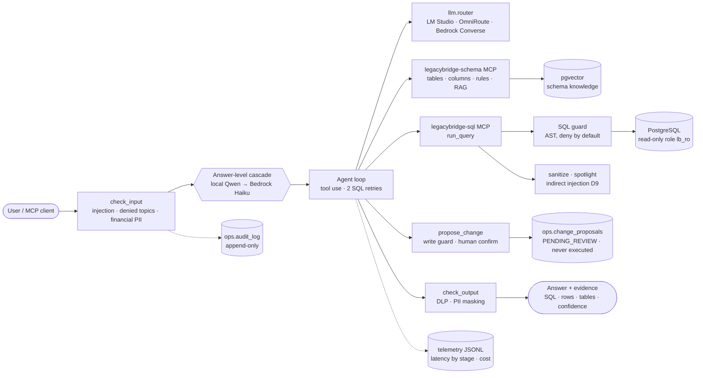

# LegacyBridge

**An AI agent that safely answers business questions over legacy enterprise databases through MCP —
with verifiable evidence, reproducible evaluation, layered guardrails and a cost-aware model cascade.**

> Status: ✅ Phases 0–6 — the cost cascade meets its target: Bedrock-level accuracy at 6% of the
> Bedrock cost. See [`docs/PLAN.md`](docs/PLAN.md).

> **Companion project: [Inventory Copilot](https://github.com/mcorona/AI-projects-inventory-copilot).**
> LegacyBridge answers *can I trust what the agent **says** about my data?*: read-only questions over a
> hostile legacy schema, through MCP, with verifiable evidence, a silent-wrong-answer rate (SWAR) and a
> model cascade at 6% of the Bedrock cost. Inventory Copilot answers *can I trust what the agent **does**?*:
> purchase-order actions governed by the database, a 7-model Bedrock comparison and a real AWS deployment
> (CDK + cdk-nag, Lambda, Aurora).

## Why
Critical business data still lives in decades-old ERPs: cryptic table names (`cliemae`, `artmae`),
no foreign keys, dates stored as `VARCHAR(8)`, `CHAR(1)` flags where `NULL` means "no", magic status
codes, mixed units and currencies. Generic text-to-SQL demos return confident, wrong numbers on them.

LegacyBridge encodes that institutional knowledge — schema tools, a business dictionary and ten
documented legacy defects ([`docs/LEGACY_DEFECTS.md`](docs/LEGACY_DEFECTS.md)) — and proves every
answer with the SQL it actually ran and the rows it got back.

## Results
Held-out **test split** (90 questions), synthetic ERP data with every defect seeded, same tools and
prompt for every model. Every figure links to a versioned report with a reproducibility fingerprint
(commit, golden-set, prompt, tool-spec, data and index hashes, model ids, prices).

| Metric | Local Qwen3.6 (×3) | Bedrock Haiku 4.5 (×3) | **Cascade local → Haiku (×3)** | Opus 4.5 ceiling (×1) | OmniRoute free (×1) |
|---|---|---|---|---|---|
| **Execution accuracy** (result sets, not SQL text) | 95.4% | 93.3% | **95.4%** | 93.8% | 88.8% |
| **SWAR** — silent wrong answers (wrong *and* confidence ≥ 0.6) | 3.8% | 6.7% | **4.6%** | 6.2% | 11.2% |
| Runs completed | 97.0% | 100% | **100%** | 100% | 100% |
| Questions escalated | — | — | 6.3% | — | — |
| False refusals on legitimate questions | 0% | 0% | 0% | 0% | 0% |
| Latency p50 / p95 | 19 s / 43 s | 9 s / 16 s | 17 s / 43 s | 15 s / 26 s | 17 s / 28 s |
| Cost per query (real, AWS list price) | $0 | $0.0281 | **$0.0018** | $0.1315 | $0 |

**Phase 5 target met:** the cascade reaches **102%** of Bedrock-only accuracy at **6.4%** of its cost
(target: ≥ 95% at ≤ 20%). It completes every run by escalating the 6% of questions where the local model
gets stuck. A bigger model did not help: Haiku and Opus score below local Qwen with the same tools — on
this problem, business context (rules, name hints, evidence) matters more than model size.

Ranges across repetitions, per-level breakdowns and the comparability check are in the reports:
[local](evals/reports/2026-09-28-2307-test-local.md) ·
[Bedrock](evals/reports/2026-10-01-2258-test-bedrock.md) ·
[cascade](evals/reports/2026-10-01-2343-test-cascade.md) ·
[Opus 4.5](evals/reports/2026-10-02-0119-test-bedrock_ceiling.md) ·
[OmniRoute](evals/reports/2026-09-29-0051-test-omniroute.md) ·
[comparison](evals/reports/2026-10-01-phase5-comparison.md).

**Security** — adversarial prompts, 3 runs each ([golden set](evals/reports/2026-09-28-adversarial-local-rescored.md),
[held-out](evals/reports/2026-09-28-holdout-local-rescored.md)):

| Attack set | Expected behavior | Safe handling | Leaks | Writes executed |
|---|---|---|---|---|
| 15 golden-set attacks | 80.0% | 100% | 0 | 0 |
| 15 held-out attacks, written *before* the defenses | 93.3% | 100% | 0 | 0 |

How the numbers moved: Phase 3 baseline 77.9% accuracy / 5.4% SWAR / 84.1% completed → current
95.4% / 3.8% / 97.0%, after did-you-mean hints for cryptic names, an evidence pointer and the
Phase 4 guardrails. Measurement corrections are published next to the original numbers
([ADR-005](docs/adr/005-evaluation-methodology.md), [ADR-006](docs/adr/006-guardrails-and-human-in-the-loop.md)).

## Architecture


- **Evidence is recorded by the loop, never by the model.** Every successful `run_query` stores the
  executed SQL, rows and tables; the model can only point to one of them ([ADR-004](docs/adr/004-rag-and-agent-evidence-contract.md)).
- **Defense in depth for reads.** AST guard (single SELECT, table and schema allowlist, deny-by-default
  functions, no catalogs, forced LIMIT) → fail-closed preflight (`current_user = lb_ro`, read-only
  transaction) → 5 s statement timeout → rollback. Restricted tables have no grants at all
  ([ADR-003](docs/adr/003-mcp-v2-and-guard-function-policy.md)).
- **Writes are proposals.** The agent can draft an INSERT/UPDATE/DELETE on allowlisted tables (WHERE
  required, impact estimated with a read-only COUNT); a human confirms, a reviewer approves or rejects,
  and nothing in the system ever executes it ([ADR-006](docs/adr/006-guardrails-and-human-in-the-loop.md)).
- **Cost first.** Local Qwen answers by default; a question is re-asked on Bedrock Haiku only if the
  local result fails an explicit policy (provider error, unfinished run, SQL failed twice, answer without
  evidence, low confidence) ([ADR-001](docs/adr/001-cost-cascade.md), [ADR-007](docs/adr/007-cost-cascade-and-observability.md)).

## What it demonstrates
| Capability | Where |
|---|---|
| MCP servers (schema explorer + read-only SQL), usable from Claude Code or MCP Inspector | `src/legacybridge/mcp_servers/` |
| AST SQL guard, write guard, least-privilege PostgreSQL roles | `src/legacybridge/guard/`, `db/legacy/` |
| Provider-neutral LLM layer: tool calling and embeddings over LM Studio, OmniRoute and Bedrock Converse | `src/legacybridge/llm/` |
| Validated business dictionary (column semantics, rules, catalogs, defects) | `config/business_dictionary.yaml` |
| Schema RAG in pgvector with redaction of restricted names and incremental indexing | `src/legacybridge/rag/` |
| Tool-use agent with self-correction, did-you-mean hints and verifiable evidence | `src/legacybridge/agent/` |
| Guardrails: direct/indirect prompt injection (incl. base64 and zero-width tricks), denied topics, DLP, Mexican PII formats, append-only audit log, optional Bedrock Guardrails | `src/legacybridge/guardrails/` |
| Human-in-the-loop change proposals with separate proposer/reviewer roles | `src/legacybridge/agent/proposals.py` |
| Answer-level cost cascade and per-turn telemetry | `src/legacybridge/agent/cascade.py`, `src/legacybridge/telemetry.py` |
| Reproducible evaluation: 120-question golden set (dev/test), 15-item adversarial holdout, execution accuracy, SWAR, refusal and safety rates, cost, fingerprints | `evals/` |
| Deterministic synthetic ERP data with every defect seeded | `scripts/gen_data.py` |

## Failure modes
What still goes wrong, measured on the test split — not hidden:

- **Silent wrong answers (3.8% local, 4.6% cascade).** The agent is sometimes confidently wrong on defect traps: summing
  amounts across currencies instead of grouping them (D7), converting boxes to pieces but not excluding
  kilograms (D6), counting orphan lines with an inner join (D2). The model reports confidence ≈ 1.0, so
  **confidence-based escalation cannot catch these**; only objective signals (unfinished runs, SQL
  failures, missing evidence) trigger the cascade.
- **Reasoning runaway on the local model.** On some adversarial prompts (catalog discovery, "what other
  tables exist?") Qwen reasons until `max_tokens` and returns nothing. No data leaks, but no explicit
  refusal either; the cascade is designed to escalate these (`provider_error`).
- **A false but harmless answer.** Asked what other tables exist, the agent sometimes says "no other
  tables exist" — nothing is revealed, but the statement is untrue.
- **Heuristic guardrails.** Injection rules and denied topics are deterministic patterns: a sufficiently
  novel paraphrase can reach the model. The SQL guard, database grants and the never-execute write path
  are what keep that from becoming a data or integrity incident (100% safe handling on both attack sets).
- **Evaluation limits.** Result-set comparison accepts extra columns (tolerant mode; strict is reported
  too) and treats business labels from the dictionary as equivalent to codes. Local model output varies
  between runs even at temperature 0, which is why every official figure is a mean of repetitions.
- **Two questions every model misses.** d019 and d018 fail on all four providers; the reference answers
  apply a business rule (valid orders) or an exclusion (orphan stock) the question leaves implicit. They
  are flagged for golden-set review rather than silently changed, which would break run comparability.
- **Managed guardrails add little here.** A live Amazon Bedrock Guardrails probe (prompt-attack filter,
  denied topic, RFC regex) blocked 53% of the must-refuse attacks vs 65% for the local deterministic
  layer, caught none the local layer missed, and had 0 false positives
  ([report](evals/reports/2026-10-01-bedrock-guardrails-live.md)). It stays optional.

## Quick start
Requirements: Python 3.12+, Docker, [LM Studio](https://lmstudio.ai) serving `qwen/qwen3.6-35b-a3b`
and `text-embedding-bge-m3` on `:1234`. OmniRoute and AWS Bedrock are optional.

```bash
make setup                 # virtualenv + dependencies, creates .env from .env.example
make db                    # PostgreSQL 16 + pgvector on :5433 (schema, roles, anchor rows)
make db-migrate            # RAG store, audit log, change proposals
make seed                  # deterministic synthetic ERP data (seed 42)
make index                 # schema knowledge into pgvector
make test                  # full test suite
make demo                  # 90-second scripted tour (answer + evidence, guardrails, human-in-the-loop)
make ask Q="¿Cuántos clientes activos hay?"      # answer, evidence, tool trace, tokens, cost
```

More: `make eval` (official evaluation, test × 3, ~1.5 h locally) · `make agent-check` (quick dev run) ·
`make proposals` (review change proposals) · `make telemetry` (latency by stage, cost, escalations) ·
`make mcp-check` / `make mcp-dev SERVER=schema|sql` (MCP Inspector) · `make ask P=cascade Q="..."`.

The container is named `legacybridge-db` (port 5433): a second checkout reuses the running database —
skip `make db` there and run the other targets with `make -o db <target>`. A fresh volume runs every
script in `db/legacy/` automatically (schema, roles, RAG store, audit log, proposals).

The MCP servers are registered in [`.mcp.json`](.mcp.json): open the repo in Claude Code and the
`legacybridge-schema` and `legacybridge-sql` tools are available.

## MCP tools
| Server | Tool | Purpose |
|---|---|---|
| `legacybridge-schema` | `list_tables` | Queryable tables with business concept, key and synonyms |
| | `describe_table` | Real column types + meaning, defect tags (D1–D10), joins, rules, catalogs |
| | `find_columns(concept)` | Maps a business concept ("order date", "currency") to ranked columns |
| | `get_business_rule(term)` | Business rules and code catalogs ("valid order", "active customer") |
| | `search_knowledge(query)` | Semantic search over schema knowledge (pgvector, bge-m3) |
| `legacybridge-sql` | `run_query(sql)` | AST guard → `lb_ro` preflight → read-only txn with 5 s timeout → rows + normalized SQL, sanitized and PII-masked for the client |

Every tool is annotated read-only. Failures return a `stage` (`guard`, `connection`, `preflight`,
`execution`), a machine-readable reason and, for misspelled names, suggestions.

## AWS mapping
| Concern | Here | AWS service |
|---|---|---|
| Model inference with tool use | `llm.router` (Converse API) | Amazon Bedrock — Claude Haiku 4.5 |
| Managed guardrails | `guardrails.bedrock` (ApplyGuardrail adapter, optional) | Amazon Bedrock Guardrails |
| Embeddings | local bge-m3 by default; Titan v2 optional | Amazon Titan Text Embeddings V2 |
| Agent loop, tools, confirmation | explicit loop, MCP tools, `propose_change` | Bedrock Agents / AgentCore (action groups, `requireConfirmation`) |
| Per-turn telemetry | JSONL with stage latency, tokens, cost | CloudWatch EMF metrics · AgentCore Observability spans |
| Cost control | verified prices (AWS Price List API) in every report | AWS Price List API · AWS Budgets |

## Architecture decisions
[001](docs/adr/001-cost-cascade.md) cost cascade ·
[002](docs/adr/002-empty-completion-escalation.md) empty completions escalate ·
[003](docs/adr/003-mcp-v2-and-guard-function-policy.md) MCP 2.x and deny-by-default SQL functions ·
[004](docs/adr/004-rag-and-agent-evidence-contract.md) RAG and the evidence contract ·
[005](docs/adr/005-evaluation-methodology.md) evaluation methodology ·
[006](docs/adr/006-guardrails-and-human-in-the-loop.md) guardrails and human-in-the-loop ·
[007](docs/adr/007-cost-cascade-and-observability.md) answer-level cascade and observability.

## Data and license
All data is synthetic, generated deterministically by `scripts/gen_data.py`; no real company or
person is represented. Code under the [MIT License](LICENSE).
